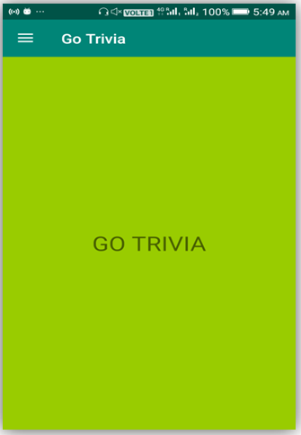
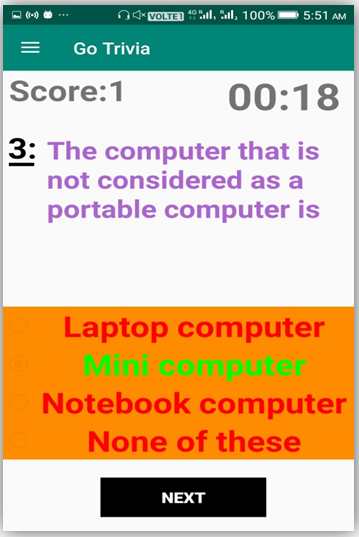
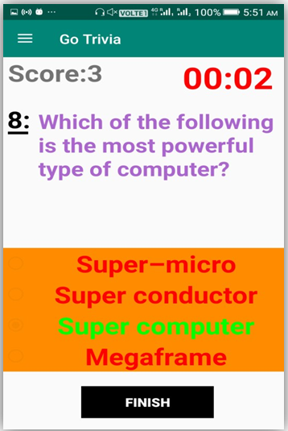
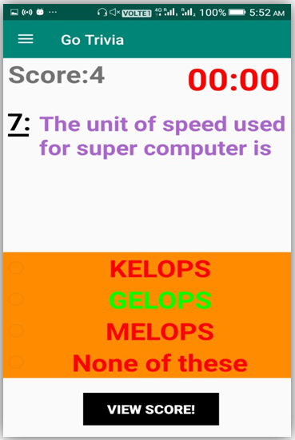
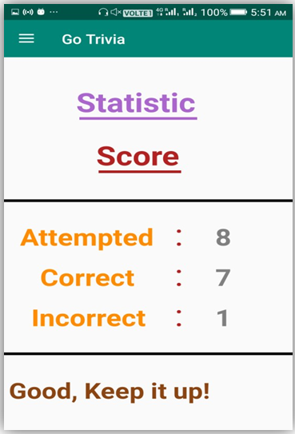
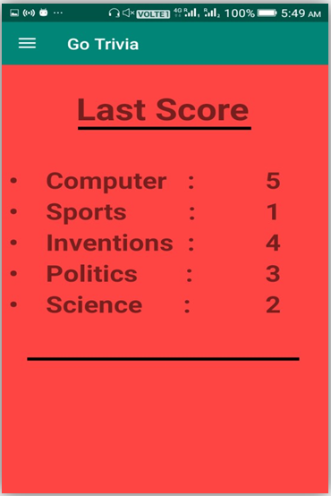
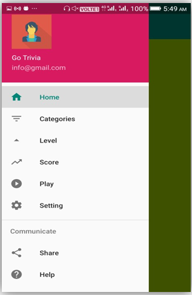
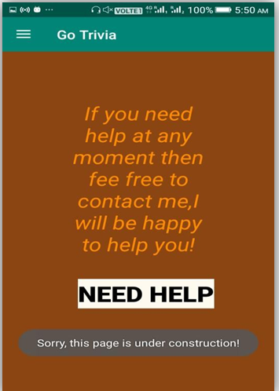
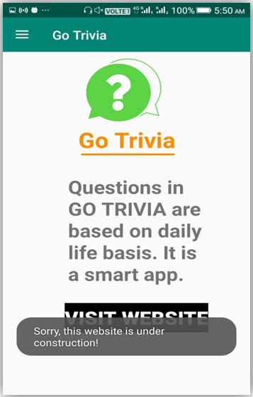

# Quiz-App-GoTrivia
A simple android quiz app
## Tools Used:-
Android Studio, Phonegap, Sqlite (database)
## Screenshots
<pre>         </pre> 
<pre>   </pre> 
<pre>         </pre> 
Open and run in android studio. 
Hope this small project may help...! GoodLuck..
